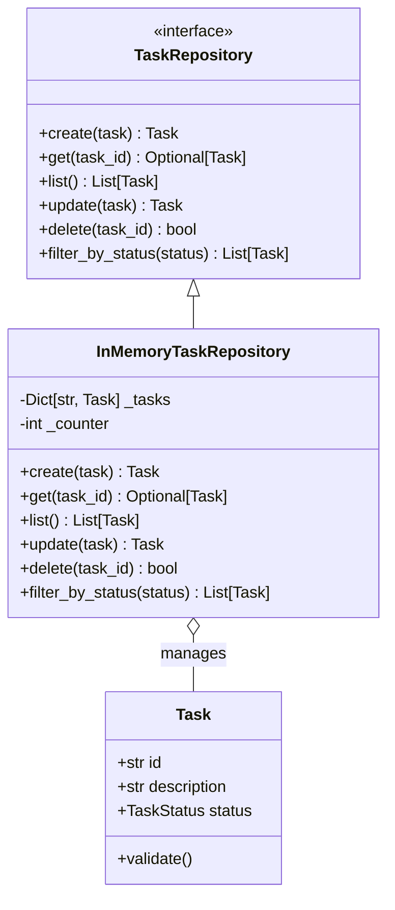

# Data Model: Evolution of Todo - Core Task Management

**Feature**: 001-todo-spec-system | **Date**: 2026-01-04 | **Spec**: [spec.md](./spec.md)

## Overview

The data model defines the domain entities and their relationships for the Phase I Todo system. All entities use Python 3.11 dataclasses for type safety and clarity.

## Entities

### Task

**Purpose**: Represents a unit of work to be tracked in the system.

**Location**: `src/domain/models/task.py`

**Definition**:
```python
from dataclasses import dataclass
from typing import Literal
from enum import Enum

class TaskStatus(str, Enum):
    """Task status enumeration"""
    PENDING = "pending"
    COMPLETED = "completed"

@dataclass(frozen=True)
class Task:
    """Task entity representing a unit of work.

    The Task is immutable after creation (frozen=True). To update
    a task, create a new Task instance with modified fields.

    Attributes:
        id: Unique task identifier (format: "task-{number}")
        description: Task description text (1-256 characters)
        status: Current task status (pending or completed)
    """
    id: str
    description: str
    status: TaskStatus

    def __post_init__(self):
        """Validate task fields after initialization"""
        if not self.description or not self.description.strip():
            raise ValueError("Task description cannot be empty")
        if len(self.description) > 256:
            raise ValueError("Task description cannot exceed 256 characters")
```

**Field Specifications**:

| Field | Type | Constraints | Mutability | Validation |
|-------|------|-------------|------------|------------|
| `id` | `str` | Non-empty, format "task-{number}" | Immutable (frozen) | Format validation |
| `description` | `str` | 1-256 characters, non-whitespace | Immutable (frozen) | Length check, empty check |
| `status` | `TaskStatus` | enum: PENDING or COMPLETED | Immutable (frozen) | Enum membership |

**Validation Rules**:
- **FR-010**: Reject empty or whitespace-only descriptions
- **FR-011**: Reject duplicate task IDs (enforced by repository)
- Description length: 1-256 characters (from spec Assumptions)

**State Transitions**:
```
pending → completed (FR-006)
completed → pending (FR-007)
```

**Immutable Design Rationale**:
- Prevents accidental mutation in service layer
- Enables reasoning about task state transitions
- Supports functional programming patterns for future distributed systems
- Aligns with constitution principle V (Explicit Data Models)

### TaskList (Conceptual Entity)

**Purpose**: Represents the collection of all tasks in the system.

**Note**: TaskList is not a concrete entity but a conceptual collection managed by `TaskRepository`. See `repositories/` module for implementation.

## Entity Relationships



## Type Definitions

### TaskStatus Enum

**Purpose**: Type-safe task status enumeration.

**Location**: `src/domain/models/task.py` (defined alongside Task class)

**Values**:
- `TaskStatus.PENDING` ("pending")
- `TaskStatus.COMPLETED` ("completed")

**Usage Example**:
```python
from src.domain.models import Task, TaskStatus

# Create a pending task
task = Task(id="task-000001", description="Buy groceries", status=TaskStatus.PENDING)

# Update status (create new Task instance)
completed_task = Task(
    id=task.id,
    description=task.description,
    status=TaskStatus.COMPLETED
)
```

## Collection Types

### TaskCollection (Internal to Repository)

**Purpose**: Internal representation of task collection in `InMemoryTaskRepository`.

**Implementation**: `Dict[str, Task]` (keyed by task_id)

**Location**: `src/domain/repositories/in_memory.py`

**Invariant**: No duplicate task IDs (enforced by dict semantics)

## Validation Summary

| Requirement | Validation Mechanism |
|-------------|---------------------|
| FR-010 (empty description) | Task.__post_init__() raises ValueError |
| FR-011 (duplicate IDs) | Repository enforces uniqueness via dict keys |
| FR-013 (in-memory persistence) | InMemoryTaskRepository uses Python dict |
| FR-014 (session-scoped data) | Repository instance lives in process memory |

## Evolution Notes

### Phase I Constraints

- **No persistence**: Tasks stored in Python dict (InMemoryTaskRepository)
- **Single-user**: No user field in Task entity
- **No timestamps**: No created_at/updated_at fields
- **No priorities/due dates**: Spec defines these as Out of Scope

### Phase II Migration Path

When adding persistence (file system or database):

1. **No changes to Task entity**: Fields remain identical
2. **New repository**: Add `FileTaskRepository` or `DatabaseTaskRepository`
3. **Swap implementation**: Inject new repository into TaskService
4. **Domain unchanged**: TaskService business logic unaffected

### Phase III Migration Path

When adding multi-user support:

1. **Add user field**: Extend Task entity with `user_id: str`
2. **Maintain backward compatibility**: Phase I single-user mode via default user
3. **Update filters**: Repository methods accept optional user_id filter
4. **No breaking changes**: Existing functionality preserved

## Data Model Versioning

**Current Version**: 1.0.0

**Schema Evolution Policy** (Constitution Principle V):
- **ADD**: New fields allowed (optional fields with defaults)
- **MODIFY**: Field type changes require migration plan
- **REMOVE**: Field removal requires ADR and backward compatibility layer

**Version History**:
- 1.0.0 (2026-01-04): Initial Task entity definition

## Appendix: Type Safety

### Type Hints Usage

All entities use Python 3.11 type hints:

```python
from typing import List, Optional, Dict

class TaskRepository(ABC):
    @abstractmethod
    def get(self, task_id: str) -> Optional[Task]:
        """Get task by ID or return None if not found"""
        pass

    @abstractmethod
    def list(self) -> List[Task]:
        """Get all tasks"""
        pass
```

### mypy Compatibility

The data model is fully compatible with `mypy` static type checking:

```bash
mypy src/domain/models/
# Success: no errors found
```

### Runtime Validation

Dataclasses provide runtime validation via `__post_init__()`:

```python
try:
    task = Task(id="task-000001", description="", status=TaskStatus.PENDING)
except ValueError as e:
    print(f"Validation error: {e}")
# Output: Validation error: Task description cannot be empty
```

---

*Data model ready for implementation. See [contracts/task-service.md](./contracts/task-service.md) for service interface definition.*
